# DataVault 🏛️

**Privacy-Preserving Multi-Agent Data Analytics System**

A sophisticated multi-agent system using LangGraph to orchestrate data analysis workflows with Model Context Protocol (MCP) connecting LLMs to local DuckDB. Features a modern Streamlit UI for interactive data exploration.

[](https://github.com/kaushikkumarkr/Data-Analysis-MAS/actions/workflows/ci.yml)
[](https://www.python.org/downloads/)
[](https://opensource.org/licenses/MIT)

## 🌟 Features

- **🔒 Privacy-First**: All data processing happens locally with DuckDB
- **🤖 Multi-Agent Architecture**: Specialized agents for cleaning, analysis, and visualization
- **🧠 Semantic Memory**: Remember context across sessions with pgvector
- **📊 Observability**: Full tracing and evaluation with Langfuse
- **⚡ Local LLMs**: MLX on Apple Silicon or Ollama for any platform
- **🎨 Modern UI**: Streamlit-based interface with dark theme

---

## 🏗️ System Architecture

```mermaid
flowchart TB
    subgraph UI["🎨 Streamlit UI"]
        HOME[Home Page]
        QUERY[Query Page]
        EXPLORER[Data Explorer]
        DASHBOARD[Dashboard]
        DATASETS[Datasets]
    end

    subgraph AGENTS["🤖 LangGraph Multi-Agent System"]
        ROUTER[Router Agent]
        CLEANER[Cleaner Agent]
        ANALYST[Analyst Agent]
        VISUALIZER[Visualizer Agent]
        
        ROUTER --> CLEANER
        ROUTER --> ANALYST
        ROUTER --> VISUALIZER
    end

    subgraph MCP["📡 Model Context Protocol"]
        SERVER[MCP Server]
        CLIENT[MCP Client]
        TOOLS[DuckDB Tools]
        
        SERVER --> TOOLS
        CLIENT --> SERVER
    end

    subgraph LLM["🧠 LLM Layer"]
        FACTORY[LLM Factory]
        MLX[MLX Backend]
        OLLAMA[Ollama Backend]
        
        FACTORY --> MLX
        FACTORY --> OLLAMA
    end

    subgraph MEMORY["💾 Semantic Memory"]
        EMBEDDINGS[Embeddings]
        VECTORSTORE[Vector Store]
        MEM0[Mem0 Layer]
        
        MEM0 --> EMBEDDINGS
        MEM0 --> VECTORSTORE
    end

    subgraph DATA["🗄️ Data Layer"]
        DUCKDB[(DuckDB)]
        POSTGRES[(PostgreSQL)]
        CSV[CSV Files]
    end

    subgraph OBSERVABILITY["📊 Observability"]
        LANGFUSE[Langfuse]
        METRICS[Metrics]
        BENCHMARKS[Benchmarks]
    end

    UI --> AGENTS
    AGENTS --> MCP
    AGENTS --> LLM
    AGENTS --> MEMORY
    MCP --> DATA
    MEMORY --> POSTGRES
    AGENTS --> OBSERVABILITY
```



---

## 🔄 Data Flow


---

## 🧩 Component Details


---

## 📦 Installation

### Prerequisites

- Python 3.11+
- [uv](https://github.com/astral-sh/uv) (recommended) or pip
- Docker (for Langfuse observability)

### Quick Start

```bash
# Clone the repository
git clone https://github.com/kaushikkumarkr/Data-Analysis-MAS.git
cd Data-Analysis-MAS

# Create virtual environment and install
uv venv
source .venv/bin/activate
uv pip install -e ".[dev]"

# Copy environment template
cp .env.example .env
```

### LLM Backend Setup

**Option A: MLX (Apple Silicon - Recommended)**
```bash
# MLX is included in dependencies, just works on M1/M2/M3
```

**Option B: Ollama (Any Platform)**
```bash
brew install ollama
ollama pull llama3.2
ollama serve
```

### Langfuse Setup (Optional)

```bash
cd docker && docker compose up -d
# Access Langfuse at http://localhost:3000
```

---

## 🚀 Usage

### Streamlit UI

```bash
streamlit run ui/app.py
# Open http://localhost:8501
```

### CLI

```bash
python scripts/cli.py
```

### Programmatic

```python
from src.mcp.client import create_client
from src.agents.graph import DataVaultGraph

with create_client() as client:
    client.load_dataset("data/sample/sales_data.csv", "sales")
    graph = DataVaultGraph(client)
    result = graph.run({"task": "What are the top products?"})
    print(result["final_answer"])
```

---

## 🧪 Testing

```bash
# Run all tests
pytest tests/ -v

# With coverage
pytest tests/ -v --cov=src --cov-report=term-missing

# 185 tests passing
```

---

## 📁 Project Structure

```
datavault/
├── src/
│   ├── db/              # DuckDB manager & schemas
│   ├── mcp/             # MCP server, client, tools
│   ├── agents/          # LangGraph agents & nodes
│   ├── memory/          # Semantic memory (pgvector)
│   ├── evaluation/      # Langfuse & benchmarks
│   └── utils/           # Config, logging, LLM wrappers
├── ui/                  # Streamlit application
│   ├── app.py           # Main entry point
│   ├── pages/           # Multi-page app
│   └── components/      # Reusable UI components
├── tests/
│   ├── unit/            # Unit tests
│   └── integration/     # Integration tests
├── scripts/             # CLI & utilities
├── docker/              # Docker Compose for services
└── data/sample/         # Sample datasets
```

---

## 🔧 Configuration

```bash
# .env configuration
LLM_BACKEND=auto          # auto, mlx, or ollama
MLX_MODEL=mlx-community/Llama-3.2-3B-Instruct-4bit
OLLAMA_MODEL=llama3.2

# Langfuse (optional)
LANGFUSE_PUBLIC_KEY=pk-lf-...
LANGFUSE_SECRET_KEY=sk-lf-...
LANGFUSE_HOST=http://localhost:3000
```

---

## 📊 Agents

| Agent | Purpose | Capabilities |
|-------|---------|--------------|
| **Router** | Task classification | Determines which agent to use |
| **Cleaner** | Data quality | Null handling, deduplication |
| **Analyst** | SQL analysis | Query generation & execution |
| **Visualizer** | Data viz | Chart recommendations |

---

## 🤝 Contributing

1. Fork the repository
2. Create a feature branch (`git checkout -b feature/amazing-feature`)
3. Commit changes (`git commit -m 'Add amazing feature'`)
4. Push to branch (`git push origin feature/amazing-feature`)
5. Open a Pull Request

---

## 📄 License

MIT License - see [LICENSE](LICENSE) for details.

---

## 🙏 Acknowledgments

- [LangGraph](https://github.com/langchain-ai/langgraph) - Agent orchestration
- [DuckDB](https://duckdb.org/) - In-process analytics database
- [Langfuse](https://langfuse.com/) - LLM observability
- [MLX](https://github.com/ml-explore/mlx) - Apple Silicon ML framework
